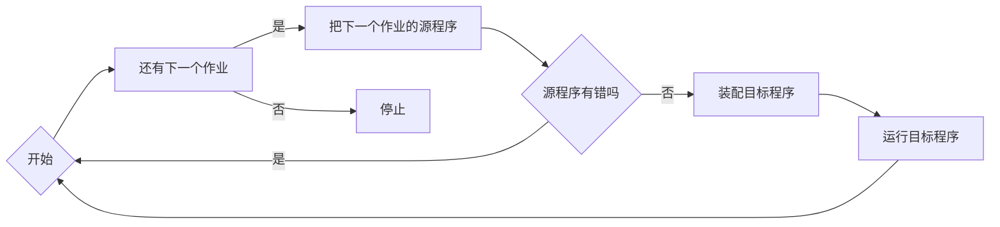
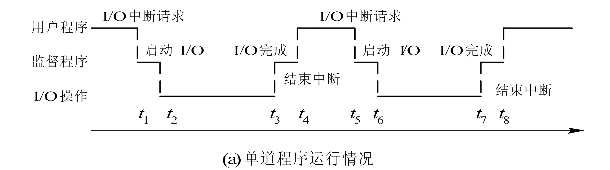
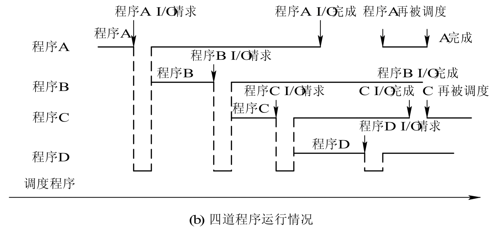

## [操作系统引论](../操作系统原理.md)
# 操作系统的发展
<!-- vscode-markdown-toc -->
* [无操作系统的计算机系统](#1)
	* [人工操作方式](#1.1)
	* [脱机I/O方式](#1.2)
* [单道-批处理系统（Simple Batch Processing System）](#2)
	* [配置监督程序](#2.1)
	* [特征](#2.2)
	* [缺点](#2.3)
* [多道-批处理系统（Multiprogrammed Batch Processing System）](#3)
	* [特点](#3.1)
	* [改进](#3.2)
	* [优点](#3.3)
	* [缺点](#3.4)
	* [需要解决的问题](#3.5)
* [分时系统（Time Sharing System）](#4)
	* [要求](#4.1)
	* [关键问题](#4.2)
	* [特性](#4.3)
* [实时系统（Real Time System）](#5)
	* [要求](#5.1)
	* [实时任务](#5.2)
	* [特征](#5.3)

<!-- vscode-markdown-toc-config
	numbering=false
	autoSave=true
	/vscode-markdown-toc-config -->
<!-- /vscode-markdown-toc -->
---
## 无操作系统的计算机系统

### 人工操作方式
* 独占性：**用户独占全机** 
* 串行性：**CPU等待人工操作**

### 脱机I/O方式
程序和数据的I/O由**外围机**控制下完成——存入磁盘/磁带
* **减少了CPU的空闲时间**
* **提高了I/O速度**

---
## 单道-批处理系统（Simple Batch Processing System）

### 配置监督程序

内存中仅有一道程序

### 特征
* **自动性**
* **顺序性**

### 缺点
资源得不到充分利用，CPU需要等待**低速I/O**操作才能运行

---
## 多道-批处理系统（Multiprogrammed Batch Processing System）

用户提交的作业在**外存**排成**后备队列**

**作业调度程序**按一定算法从队列中将数个程序调入**内存**共享资源

### 特点
* 多道
* 成批处理
* 无序性
* 调度性
  
### 改进
* 提高了CPU的利用率
* 提高了内存和IO的利用率
* 增加了系统的吞吐量
  
### 优点
* 资源利用率高
* 系统吞吐量大

### 缺点
* 平均周转周期长
* 无用户交互能力
  
### 需要解决的问题
* 处理机管理
* 内存管理
* IO设备管理
* 文件管理
* 作业管理

---
## 分时系统（Time Sharing System）

### 要求
* **人机交互**
* **多用户共享主机**
* **便于用户上机**

### 关键问题
及时接收、及时处理

实现：
* **作业直接存入内存**
* **每个作业一次只运行很短的时间**（时间片）

### 特性
* 多路性
* 独立性
* 及时性
* 交互性

---
## 实时系统（Real Time System）

### 要求
* **实时控制**
* **实时处理**
  
### 实时任务
按任务执行时是否呈现周期性划分：
* 周期性实时任务：外部设备周期性发出激励信号给计算机，要求按指定周期循环执行
* 非周期性实时任务：外部设备发出的激励信号无明显周期性，但联系着一个截止时间  
分为**开始截止时间**和**完成截止时间**

根据截止时间的要求来划分：
* 硬实时任务：系统必须满足任务对截止时间的要求
* 软实时任务：对截止时间并不严格，偶尔错过截止时间对系统的影响不会太大

### 特征
* 多路性
* 独立性
* 及时性
* 交互性
* 可靠性