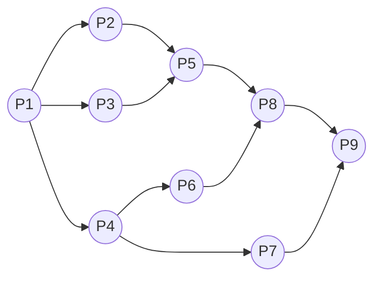

[进程管理](../操作系统原理.md)
# 进程基本概念

<!-- TOC -->

- [进程基本概念](#进程基本概念)
  - [前趋图](#前趋图)
  - [顺序执行](#顺序执行)
    - [顺序执行](#顺序执行-1)
    - [特性](#特性)
  - [并发执行](#并发执行)
    - [特征](#特征)
  - [进程的特征和状态](#进程的特征和状态)
    - [进程](#进程)
    - [特征](#特征-1)
    - [进程与程序的区别](#进程与程序的区别)
    - [进程的创建与中止](#进程的创建与中止)
    - [进程状态](#进程状态)
    - [进程控制块（Process Control Block a.k.a. PCB）](#进程控制块process-control-block-aka-pcb)
    - [进程映像](#进程映像)
    - [PCB的组织方式](#pcb的组织方式)

<!-- /TOC -->
---
## 前趋图
**前趋图**：有向无环图，记作DAG,每个节点用于描述进程/程序段/语句  
**前趋关系**：节点间的有向边用于表示两个节点之间存在偏序/前趋关系  
**重量**：程序量/执行时间  
起始/终止节点无前/后继节点  


---
## 顺序执行
### 顺序执行
用结点（Node）表示各个程序段的操作，用箭头表示操作的先后顺序
* S1:a=x+y
* S2:b=a-5
* S3:c=b+1
    ```mermaid
        graph LR;
                1((S1))-->2((S2));
                2((S2))-->3((S3))
    ```
### 特性
* 顺序性
* 封闭性:程序是在封闭环境下执行的，执行结果不受外界影响
* 可再现性：只要执行环境和初始条件相同，都能获得相同结果

---
## 并发执行
### 特征
* 间断性
* 失去封闭性：程序在并发执行时，系统资源被多个程序共享，资源状态由多个程序来改变
* 不可再现性：由于程序失去了封闭性，其计算结果和程序的执行速度相关，使程序执行失去了可再现性

---
## 进程的特征和状态
### 进程
**进程**：具有独立功能的程序关于某个数据集合上的一次运行活动，是系统进行**资源分配**的基本单位
* 进程是程序的一次执行
* 进程是一个程序及其数据在处理机上顺序执行时发生的活动
* 进程说程序在一个数据集合上运行的过程

### 特征 
由程序段、数据段和PCB构成一个**进程实体**（a.k.a.**进程映像**）  
创建/撤销进程实体指创建/销毁进程的PCB
* 动态性：由创建而产生，由调度而执行，由撤销而消亡
* 并发性：多个进程实体同时存在于内存，并在一段时间内同时运行
* 独立性
* 异步性

### 进程与程序的区别
|**进程**|**程序**|
|----|----|
|动态|静态|
|真实描述并发|N/A|
|N/A|对应多个进程|
|具有生命周期|存续相对长久|
|暂时存储|长期存储|
|分配资源的基本单位|N/A|
|由程序和数据组成|组成进程|

### 进程的创建与中止
**创建**
* 提交bat作业
* 调用OS服务
* 用户登录
* 由其他进程创建

**中止**
* 正常结束
* 定时限制
* 缺少内存
* 存储器出界
* 保护性出错（如写入只读文件）
* 算术错误
* 超出时间（进程等待超过某事件的最大值）
* IO失败
* 无效指令（试图执行数据段）
* 特权指令
* 操作系统干预（如发生死锁）
* 父进程请求终止
* 父进程被中止

### 进程状态
基本状态：
* 就绪：已分配除CPU外的其他资源
* 运行：已获得CPU的进程
* 阻塞：运行中的进程发生中断，放弃处理机
    ```mermaid
        graph LR;
                运行-->阻塞;
                阻塞-->就绪;
                就绪-->运行;
                运行-->就绪;
    ```
其他状态：
* 创建：
  * 创建进程标识符
  * 创建管理进程的表格
  * 尚未就绪，缺少其他资源
* 终止状态：
  * 不再具有执行资格
  * 表格信息由辅助程序保留
* 挂起状态：
  * 人为使进程处于静止
  * 便于修改调试

### 进程控制块（Process Control Block a.k.a. PCB）
**PCB**：系统管理进程设置的数据结构，存储了描述进程情况和控制运行的信息  
一个进程与一个PCB**一一对应**
* 进程标识符：用于唯一地标识一个进程
  * 内部标识符：操作系统为进程赋予的唯一数字标识符，用于操作系统的使用
  * 外部标识符：由创建者提供，通常由字母和数字组成，由用户/父进程在访问时使用
* 处理机状态：当进程被中断时便于从断点恢复
  * 通用寄存器信息
  * 指令计数器
  * 程序状态字（PSW）
  * 用户栈指针
* 进程调度信息
  * 进程状态
  * 进程优先级
  * 调度所需的其他信息，如等待时间、已执行时间
  * 事件：阻塞原因
* 进程控制信息
  * 程序和数据的地址
  * 进程同步和通信机制
  * 资源清单
  * 链接指针（指向进程队列中下一个PCB）
  
### 进程映像
* 用户程序
* 用户数据
* 程序栈：过程调用和参数传递
* PCB

### PCB的组织方式
1. 按链接组织：按进程状态组成队列
2. 按索引组织：按进程状态组成索引表