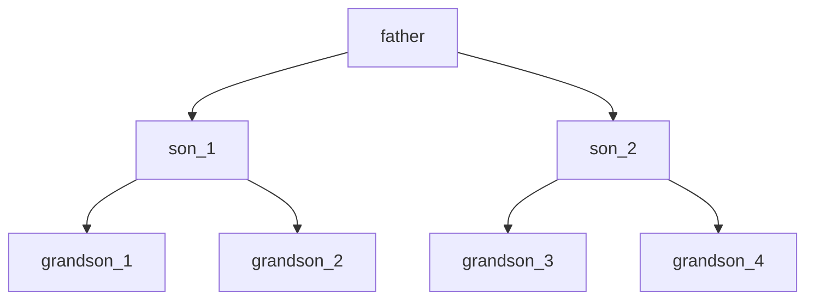

[进程管理](../操作系统原理.md)
# 进程控制

<!-- TOC -->

- [进程控制](#进程控制)
  - [进程控制](#进程控制-1)
    - [进程图](#进程图)
  - [内核](#内核)
  - [进程控制原语](#进程控制原语)
    - [进程创建——创建指定标识符进程](#进程创建创建指定标识符进程)
    - [进程撤销](#进程撤销)
    - [进程阻塞](#进程阻塞)
    - [其他原语](#其他原语)

<!-- /TOC -->
---
## 进程控制
**进程控制**由内核态实现，通过各种**原语**

### 进程图
**进程图**：描述创建与被创建的关系，与进程的执行顺序无关

---
## 内核
**内核**：硬件上的第一层硬件，执行各种原语操作实现控制和管理。  
功能：
* 中断处理
* 时钟管理
* 原语操作
* 资源管理
* 进程管理
* 存储管理
* 设备管理  
  
**原语**：由若干条机器指令组成，完成特定功能的一段程序

---
## 进程控制原语
### 进程创建——创建指定标识符进程
1. 创建PCB
2. 赋予进程标识符
3. 为进程映像分配空间
4. 初始化PCB，赋初值
5. 设置相应链接，把进程加入对应表

### 进程撤销
1. 读取PCB状态
2. 终止进程执行
3. 终止子孙进程
4. 收回进程资源，将其归还父进程/系统
5. 将PCB移出表

### 进程阻塞
引发原因
* 请求系统服务
* 启动某种操作
* 等待新数据
* 进程空闲

### 其他原语
* 唤醒进程
* 挂起进程
* 激活进程