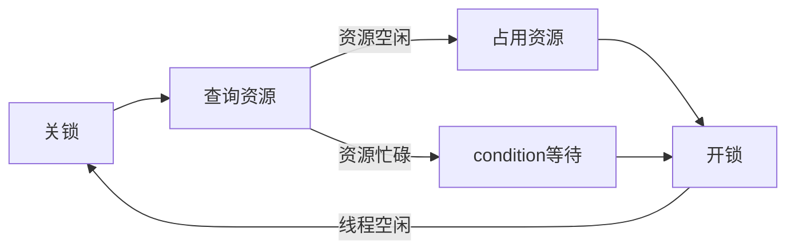

[进程管理](../操作系统原理.md)
# 线程
<!-- TOC -->

- [线程](#线程)
  - [概念](#概念)
  - [特点](#特点)
  - [线程状态和控制块](#线程状态和控制块)
    - [线程状态](#线程状态)
    - [线程控制块（TCB）](#线程控制块tcb)
  - [引入线程的优势](#引入线程的优势)
  - [比较](#比较)
  - [同步/通信](#同步通信)
    - [互斥信号量（mutex）](#互斥信号量mutex)
    - [条件变量（condition）](#条件变量condition)
    - [信号量](#信号量)
  - [线程的实现](#线程的实现)
    - [内核支持线程/核心级线程（Kernel-Level Thread a.k.a. KLT）](#内核支持线程核心级线程kernel-level-thread-aka-klt)
    - [用户级线程（User-Level Thread a.k.a. ULT）](#用户级线程user-level-thread-aka-ult)

<!-- /TOC -->
---
## 概念
**线程**（Thread）：轻量级进程，作为CPU调度的基本单位，在系统中资源的拥有者仍然为**进程**（Process）/**任务**（Task）
* 有执行状态
* 不运行时保存上下文
* 有执行栈
* 有局部变量的静态存储
* 可存取进程的内存和资源
* 可以创建/撤销其他线程

---
## 特点
* 进程的一个实体，作为系统**独立调度和分派**的基本单位
* 不拥有系统资源
* 同一进程内的线程可**并发执行**
* 系统**开销小，切换快**

---
## 线程状态和控制块
在多线程OS中，进程已不是**可执行的实体**
### 线程状态
* 执行状态
* 就绪状态
* 阻塞状态

### 线程控制块（TCB）
略

---
## 引入线程的优势
* 创建/销毁的开销低
* 切换花费时间少
* 共享内存、文件
* 适用于多处理机

---
## 比较
|||
|----|----|
|调度|线程切换不影响进程|
|并发|同一进程的线程可并发执行|
|资源|系统资源由进程所拥有|
|开销|线程的系统开销小于进程|

---
## 同步/通信
### 互斥信号量（mutex）
两种状态：
* unlock
* lock
  
可能会引起**死锁**

### 条件变量（condition）
与mutex配合使用
* mutex用于**短期锁定**
* condition用于**长期等待**

### 信号量
* 私用信号量
  * 由进程创建，实现各个线程的同步
  * OS不知道其存在，由进程所持有
* 公用信号量
  * 供所有进程使用，实现**不同进程**（中各线程）的同步
  * 由OS分配空间并管理，也叫做**系统信号量**

---
## 线程的实现
### 内核支持线程/核心级线程（Kernel-Level Thread a.k.a. KLT）
在OS内核的支持下运行，创建/阻塞/撤销/切换均在**内核空间**下实现  
TCB设置在内核空间中
* 特点
  * 管理由核心完成
  * 无线程库，但提供API
  * 进程和线程的上下文由核心维护
  * 线程切换由核心支持
  * 以线程为基础调度
* 优点
  * 多处理机核心可以同时调度一个进程的多个线程
  * 线程阻塞时可调用其他线程
  * TCB和栈空间占用小，切换速度快，开销小
  * 提高了多线程CPU的效率
* 缺点
  * 对于**用户态线程**的切换开销大

### 用户级线程（User-Level Thread a.k.a. ULT）
 由应用程序本身完成线程管理，通过**线程库**提供的过程进行管理  
 OS不知道其存在，也无需核心态权限
 * 特点
   * 核心仅管理进程活动
   * 当线程调用系统时，整个进程均被阻塞
   * 但对于线程库，线程仍在运行，即线程与进程状态独立
 * 下面没写完XD