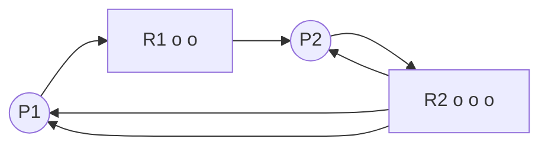

[处理机调度和死锁](../操作系统原理.md)
# 死锁的检测与解除
<!-- TOC -->

- [死锁的检测与解除](#死锁的检测与解除)
  - [死锁检测](#死锁检测)
    - [资源分配图](#资源分配图)

<!-- /TOC -->
---
## 死锁检测
### 资源分配图
表示当前资源分配状态的**一帧**

* P：进程
* R：资源（o--资源数）
* P-->R：请求边，指除去已分配外还需要得到一个资源R
* R-->P：分配边，指当前已分配给P一个资源

**简化**：找出一个既没有阻塞，又不独立的进程节点，消去其所有请求边和分配边使之孤立

在经过一系列简化后，若能消去所有边，使所有节点孤立，则称该图可完全简化，则没有发生死锁现象