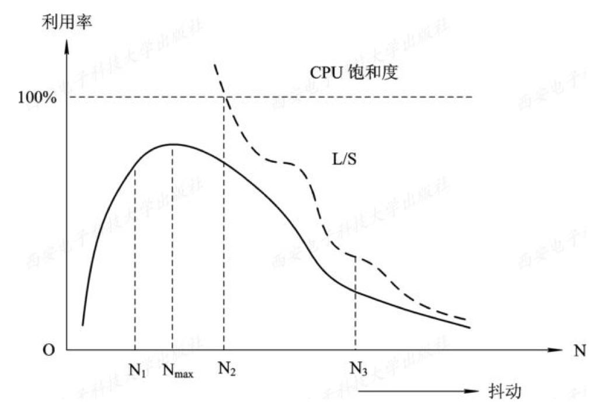
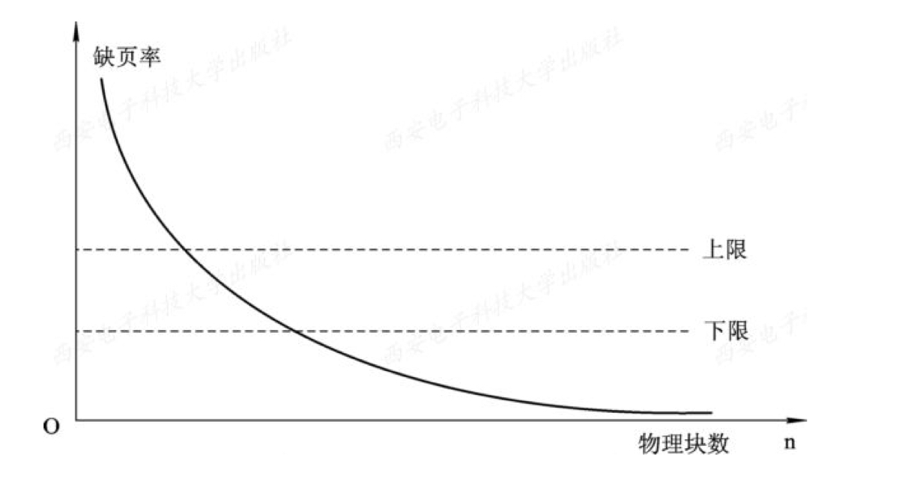

[虚拟存储器](../操作系统原理.md)
# 抖动与工作集
<!-- TOC -->

- [抖动与工作集](#抖动与工作集)
  - [抖动](#抖动)
  - [工作集](#工作集)
  - [抖动的预防](#抖动的预防)
    - [局部置换策略](#局部置换策略)
    - [工作集算法](#工作集算法)
    - ["L=S"准则](#ls准则)
    - [选择暂停的进程](#选择暂停的进程)

<!-- /TOC -->
---
## 抖动
由于虚拟存储器在逻辑上扩大内存，计算机多道程序度增加

* N：多道程序度
* L：缺页的间隔时间
* S：缺页的服务时间
* L/S：反映缺页的频率
**抖动**：同时在系统中运行的进程太多，分配给每一个进程的物理块太少，无法满足进程正常运行的基本要求。  
每个进程在运行时，频繁地出现缺页现象，大部分时间都用于页面的换入/换出，几乎不能再做任何有效工作。

进程发生缺页率的时间间隔与进程所获得的物理块数有关：

---
## 工作集
**工作集**：在某段时间间Δ内，进程实际需要访问页面的集合。  
用程序的过去某段时间内的行为作为程序在将来某段时间内行为的近似。

---
## 抖动的预防
### 局部置换策略
当某个进程发生缺页时，可把进程抖动造成的影响控制在较小范围内

### 工作集算法
当发现处理机利用率低下时，试图从外存调入新作业。  
在调入新作业之前，检查每个内存中的进程的驻留页面是否足够多，若足够多则调入，否则不调入。

### "L=S"准则
L是**缺页之间的平均时间**，S是**平均缺页服务时间**，即用于置换一个页面所需的时间。
* 若L>>S，说明很少发生缺页，磁盘读写尚未充分利用
* 若L<<S，说明频繁发生缺页，缺页速度已超过磁盘处理能力
* 若L==S，则处理机和磁盘均已达到最大利用率

### 选择暂停的进程
当多道程序度高时，处理机利用率被影响，系统必须减少多道程序的数目。